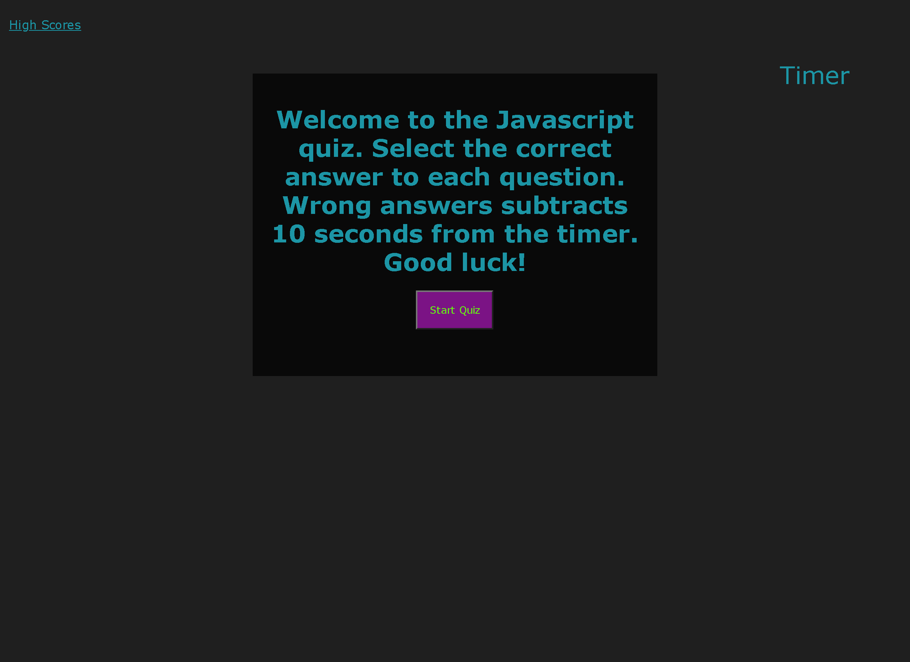

# Javascript Quiz
## Contents
1. [About](#About)
2. [Description](#Description)
3. [Screenshot](#Screenshot)
3. [License](#License)
4. [Contact-Info](#Contact-Info)

## About

https://amgaudet.github.io/javascript-quiz/index.html

A quiz on simple concepts in HTML, CSS, and Javascript. The user has 60 seconds to complete the quiz, losing 10 seconds for each incorrect answer. The option to save score displays at the end and is saved to local storage. All saved scores can be seen on the High Scores page.

## Description

The quiz is populated using javascript. When the user clicks the Start Quiz button, the program runs through an array of questions until they reach the end of the array and presented their score. Each question has 4 possible answers with its own data-index. If the selected answer's data index matches the correct position, the program moves on to the next question. If they select the wrong answer, 10 seconds is deducted from the timer. If at any point the timer reaches 0 or below 0 (for incorrect answers), the program jumps strait to the score screen at the end with a score of 0.

## Screenshot

## License

MIT License

Copyright (c) 2021 Alan Gaudet

Permission is hereby granted, free of charge, to any person obtaining a copy
of this software and associated documentation files (the "Software"), to deal
in the Software without restriction, including without limitation the rights
to use, copy, modify, merge, publish, distribute, sublicense, and/or sell
copies of the Software, and to permit persons to whom the Software is
furnished to do so, subject to the following conditions:

The above copyright notice and this permission notice shall be included in all
copies or substantial portions of the Software.

THE SOFTWARE IS PROVIDED "AS IS", WITHOUT WARRANTY OF ANY KIND, EXPRESS OR
IMPLIED, INCLUDING BUT NOT LIMITED TO THE WARRANTIES OF MERCHANTABILITY,
FITNESS FOR A PARTICULAR PURPOSE AND NONINFRINGEMENT. IN NO EVENT SHALL THE
AUTHORS OR COPYRIGHT HOLDERS BE LIABLE FOR ANY CLAIM, DAMAGES OR OTHER
LIABILITY, WHETHER IN AN ACTION OF CONTRACT, TORT OR OTHERWISE, ARISING FROM,
OUT OF OR IN CONNECTION WITH THE SOFTWARE OR THE USE OR OTHER DEALINGS IN THE
SOFTWARE.

## Contact Info

Alan Gaudet - <alanmgaudet@gmail.com>

Portfolio - <https://github.com/amgaudet>
